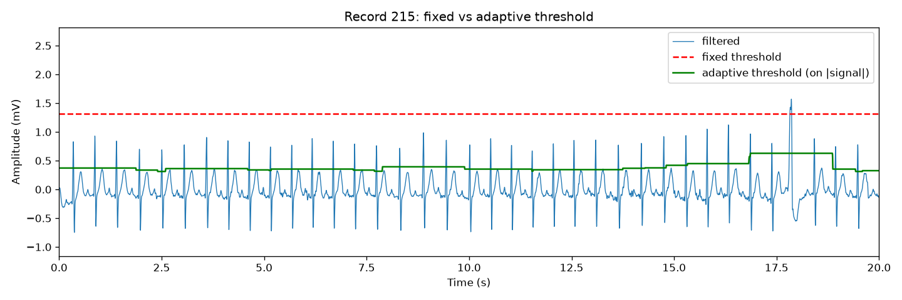
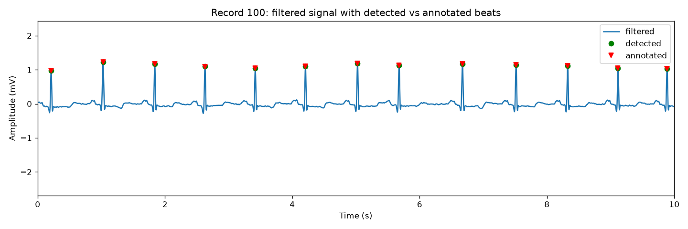
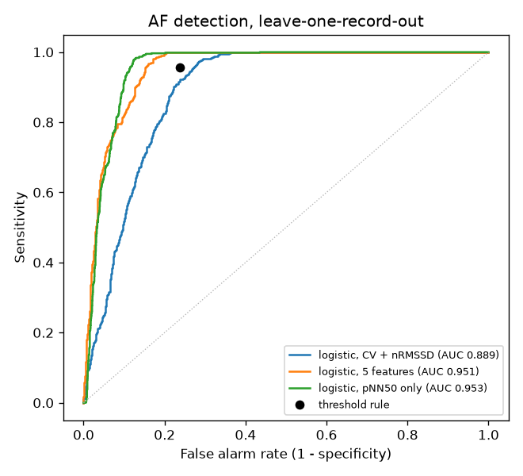
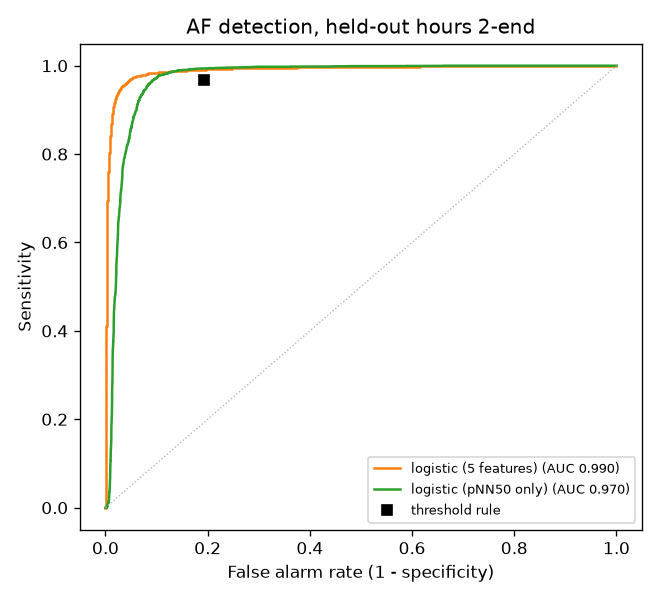
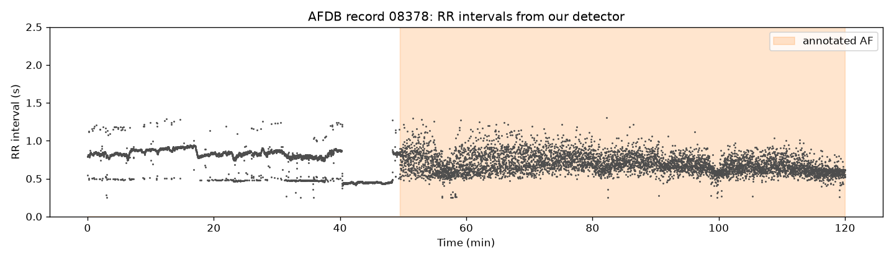
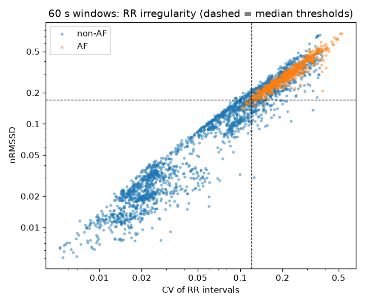
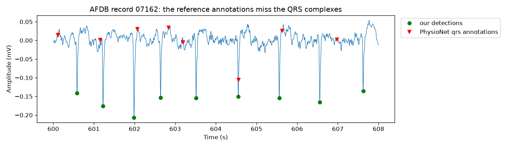

# ECG arrhythmia detection

R-peak (heartbeat) detection and atrial fibrillation (AF) screening on
PhysioNet's MIT-BIH databases. Beat detection is written from scratch
with NumPy and SciPy and benchmarked against an established detector;
AF screening uses RR-interval features and logistic regression.

| | Result |
|---|---|
| Beat detection, 36 held-out MIT-BIH records | sensitivity **99.57%**, precision **99.57%** |
| `wfdb`'s XQRS on the same records | sensitivity 98.82%, precision 99.96% |
| AF detection, 5-feature logistic regression, held-out 8 h per record | ROC AUC **0.990**; sensitivity 92.5%, specificity **98.0%** |
| AF detection, original two-threshold rule, same data | sensitivity 96.8%, specificity 80.6% |

## 1. Beat detection

[`ecg.py`](ecg.py) contains the detector:

1. **Band-pass filter** (0.5–40 Hz Butterworth, zero-phase) removes
   baseline wander and high-frequency noise.
2. **Adaptive threshold.** A peak must exceed 40% of the largest
   |signal| value within a sliding 2 s window, with a floor so the
   threshold can't collapse onto noise during pauses. Using |signal|
   catches beats whose QRS complex points downwards, which is common for
   premature ventricular beats.
3. **T-wave rejection** (from Pan & Tompkins, 1985). A candidate within
   360 ms of the previous beat whose steepest slope is under half that
   beat's is a T wave, not a new beat.

A detection counts as correct if it is within 150 ms of an annotated
beat. Ventricular flutter episodes contain no separate beats, so they
are left out of scoring, as the ANSI/AAMI EC57 standard specifies.

### Why a fixed threshold isn't enough

The first version used a single threshold at half the record's maximum.
One tall beat or artefact then sets the bar too high for everything
else. On record 215 it detected only 5% of beats:



### Results

The detector was developed while looking at 10 records (100, 101, 103,
105, 108, 200, 203, 207, 210, 215), so it is also scored on the other
36 records, which played no part in tuning. Records 102 and 104 have no
MLII lead and are skipped. Each record is scored on its first 5 minutes.

| Detector | Dev sens. | Dev prec. | Held-out sens. | Held-out prec. | Held-out missed / false |
|---|---|---|---|---|---|
| Fixed threshold | 61.13% | 99.10% | 91.90% | 97.72% | 1092 / 289 |
| **Adaptive (ours)** | 98.19% | 99.26% | **99.57%** | 99.57% | **58** / 58 |
| XQRS (`wfdb`) | 97.06% | 96.72% | 98.82% | **99.96%** | 159 / **6** |

On held-out data the two detectors make different trade-offs. Ours
misses about a third as many beats, and XQRS produces about a tenth as
many false detections. Ours is also about 25× faster (0.3 s against
7.8 s for all 36 records), though speed wasn't a design goal.

Record 203, a very noisy record with ventricular beats of many shapes,
is the weakest for our detector (91.6% sensitivity).



## 2. Atrial fibrillation check

In AF the heartbeat becomes irregularly irregular. The AF scripts run
the beat detector on the
[MIT-BIH Atrial Fibrillation Database](https://physionet.org/content/afdb/1.0.0/)
(23 records of about 10 hours each) and measure how irregular the RR
intervals (times between beats) are in each 60 s window:

| Feature | Definition | AUC alone (dev) |
|---|---|---|
| **CV** | standard deviation of RR / mean RR | 0.895 |
| **nRMSSD** | root-mean-square of successive RR differences / mean RR | 0.896 |
| **Shannon entropy** | entropy of a 16-bin histogram of RR intervals between the window's 5th and 95th percentiles, scaled to 0–1 | 0.831 |
| **TPR** (turning points ratio) | fraction of RR intervals that are a local peak or trough (≈ 2/3 for a random series) | 0.843 |
| **pNN50** | fraction of successive RR differences over 50 ms | 0.957 |

A window is labelled AF if at least half of it is annotated `(AFIB`;
atrial flutter and junctional rhythm count as non-AF.

### How the data was split

- **Development** ([`afib.py`](afib.py)): the first 2 hours of every
  record (2759 windows, 610 AF). Every design decision was made here,
  using **leave-one-record-out cross-validation**: each record is scored
  by a model fitted on the other 22 records only.
- **Held-out test** ([`afib_test.py`](afib_test.py)): hours 2 to the end
  of every record (11,180 windows, 4955 AF). Nothing was looked at until
  development was finished. The models and the rule for choosing
  cutoffs were fixed beforehand, and the test was run once.

Both sets come from the same 23 people, so the test measures how well the
models hold up **later in the same recordings**, not on new patients. The
leave-one-record-out results are the evidence for new patients.

### Classifiers

1. **Threshold rule** (the first version): AF when both CV and nRMSSD
   exceed grid-searched thresholds.
2. **Logistic regression** on CV + nRMSSD, and on all 5 features. CV and
   nRMSSD are log-transformed, since they span two orders of magnitude.
   Inputs are standardized and classes weighted equally.
3. **Logistic regression on pNN50 alone.** I added this *after* seeing
   that pNN50 alone scored as well as an earlier version of the
   5-feature model, so it is a follow-up comparison, not a planned one.

**Choosing a cutoff.** A missed AF episode matters more than a false
alarm, which a clinician can dismiss by looking at the strip. So every
classifier's cutoff is set on its training data to catch **95% of AF
windows**, then applied unchanged to the data being scored.

### Development results (leave-one-record-out, first 2 hours)

| Classifier | Sensitivity | Specificity | False alarms | Missed AF | ROC AUC |
|---|---|---|---|---|---|
| Threshold rule (CV, nRMSSD) | 93.3% | 76.9% | 496 | 41 | – |
| Logistic (CV, nRMSSD) | 92.6% | 75.5% | 526 | 45 | 0.889 |
| **Logistic (5 features)** | 93.8% | **95.3%** | **101** | 38 | **0.979** |
| Logistic (pNN50 only) | 93.6% | 89.8% | 219 | 39 | 0.953 |



**A fix found during development.** In the first version, entropy used
bins spanning each window's full RR range, and the 5-feature model reached
only 84.6% sensitivity at the 95% target. Almost all of its misses (80
of 94) came from record 07859, which is AF throughout. A few outlier RR
intervals per window stretched the histogram's range about 2.6×,
squeezing everything else into a few bins, and pulled AF windows' median
entropy from about 0.93 down to 0.69. Dropping intervals outside the
5th–95th percentiles first, as Dash et al. (2009) do, fixed it. Entropy's
AUC alone rose from 0.721 to 0.831, and the 5-feature model's from 0.951
to 0.979. Because the fix was found by studying development data, the
held-out test below is what shows whether it generalizes.

### Held-out test (hours 2 to end, run once)

| Classifier | Sensitivity | Specificity | Precision | False alarms | Missed AF | ROC AUC |
|---|---|---|---|---|---|---|
| Threshold rule (CV, nRMSSD) | **96.8%** | 80.6% | 79.9% | 1205 | **161** | – |
| **Logistic (5 features)** | 92.5% | **98.0%** | **97.3%** | **126** | 372 | **0.990** |
| Logistic (pNN50 only) | 91.2% | 93.8% | 92.1% | 388 | 436 | 0.970 |



- **The 5-feature model holds up.** Its AUC is 0.990 on the test data
  (0.979 in development), and its ROC curve is above pNN50's at almost
  every operating point, so the entropy fix generalizes.
- **It fell short of the 95% sensitivity target**, reaching 92.5%.
  Compared with the threshold rule it cuts false alarms by 90% (1205 →
  126) but misses 211 more AF windows.
- **Most of that shortfall is in the cutoff, not the model.** The
  5-feature curve passes above and to the left of the threshold rule's
  point, so some cutoff would have matched the rule's sensitivity with
  far fewer false alarms. The cutoff set on hours 0–2 simply landed too
  high for hours 2–end. Choosing it from the test data would be
  cheating, so this is left as the next thing to investigate.
- **Missed AF windows cluster in 4 records**: 07879 (93), 07859 (78),
  04936 (63) and 04043 (60 of its 119). Per-record results are in
  [`results/afib_test_windows.csv`](results/afib_test_windows.csv).

### Reading the coefficients

Coefficients of the 5-feature model fitted on all development windows, in
log-odds of AF per standard deviation of each feature, with the range
across the 23 cross-validation folds:

| Feature | Coefficient | Fold range |
|---|---|---|
| log CV | +2.43 | +2.12 to +3.50 |
| log nRMSSD | −0.62 | −0.99 to −0.29 |
| entropy | +2.97 | +2.59 to +4.01 |
| TPR | −0.15 | −0.38 to +0.03 |
| pNN50 | +2.43 | +2.27 to +2.66 |

- **Entropy, pNN50 and CV carry the model.** Once outliers are trimmed,
  entropy is almost uncorrelated with CV (r = 0.03), so it adds
  information the others don't have, which is why its weight is large.
- **The negative nRMSSD weight shouldn't be read at face value.** log CV
  and log nRMSSD are 97% correlated, so the model splits "overall
  variability" between them, one positive and one negative. On its own
  nRMSSD rises with AF (AUC 0.896).
- **TPR contributes almost nothing.** Its weight is small and changes
  sign across folds; what it measures is largely covered by pNN50
  (r = 0.66).

### Where it fails

Most false alarms in development come from records with **frequent
ectopic (extra) beats**, which make the RR series irregular without the
rhythm being AF. In the first 48 minutes of record 08378 below, the RR
intervals split into two bands, short and long; that is ectopy, not AF:



For the threshold rule this is a limit of the method, not of the beat
detector. Using PhysioNet's reference beat positions in place of ours
gives similar results (79.4% specificity, 91.1% sensitivity). The
5-feature model copes much better: development accuracy on 08378 rises
from 66% to 96%, on 05261 from 48% to 85%, and on 08219 from 25% to 74%.
08219 is still the hardest record, and it also has the most test-set
false alarms (48). Separating AF from heavy ectopy reliably would probably
need information beyond RR intervals, such as checking for missing
P waves.



### A wrong reference annotation

Measured against PhysioNet's `qrs` beat annotations for this database,
our detector scores 96.6%. Those annotations were made by a computer
program and never checked by hand. On record 07162 most of them fall
between heartbeats, while our detections land on each QRS complex:



Excluding 07162, beat detection scores 99.10% sensitivity and 98.93%
precision.

## Running it

```bash
pip install -r requirements.txt
python qrs_benchmark.py    # ~5 min; MIT-BIH data is streamed from PhysioNet
python afib.py             # development; first run downloads 2 h of each AFDB record (slow); cached in data/
python afib_test.py        # held-out test; first run downloads the other ~8 h per record (~1-2 h)
```

Per-record numbers are written to [`results/`](results/) and plots to
[`figures/`](figures/).

## Limitations

- Beat detection is scored on the first 5 minutes of each MIT-BIH record,
  not the full 30 minutes.
- The AF development and test sets come from the same 23 patients, so
  the held-out test checks generalization over time, not to new people.
- The 5-feature AF model missed its 95% sensitivity target on the test
  data (92.5%), because the cutoff chosen on development data didn't
  transfer exactly.
- Only one ECG lead is used (MLII for MIT-BIH, ECG1 for AFDB).
- This is a learning project, not a medical device.

## Data

- Moody GB, Mark RG. *The impact of the MIT-BIH Arrhythmia Database.*
  IEEE Eng Med Biol 20(3):45-50 (2001).
- Moody GB, Mark RG. *A new method for detecting atrial fibrillation
  using R-R intervals.* Computers in Cardiology 10:227-230 (1983).
- Goldberger AL et al. *PhysioBank, PhysioToolkit, and PhysioNet.*
  Circulation 101(23):e215-e220 (2000).
- Pan J, Tompkins WJ. *A real-time QRS detection algorithm.*
  IEEE Trans Biomed Eng 32(3):230-236 (1985).
- Dash S, Chon KH, Lu S, Raeder EA. *Automatic real time detection of
  atrial fibrillation.* Ann Biomed Eng 37(9):1701-1709 (2009).
